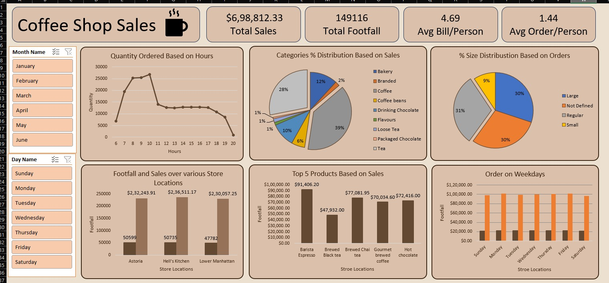

# Coffee_Sales_Analysis-_Dashboard_in_Excel
This dashboard shows overall coffee shop performance. Total sales are $698,812 with 149,116 customers. Average bill is $4.69 and 1.44 orders per person. Sales peak in morning hours. Coffee contributes the highest sales share. Regular and large sizes are most popular. Hell’s Kitchen and Astoria perform best.
